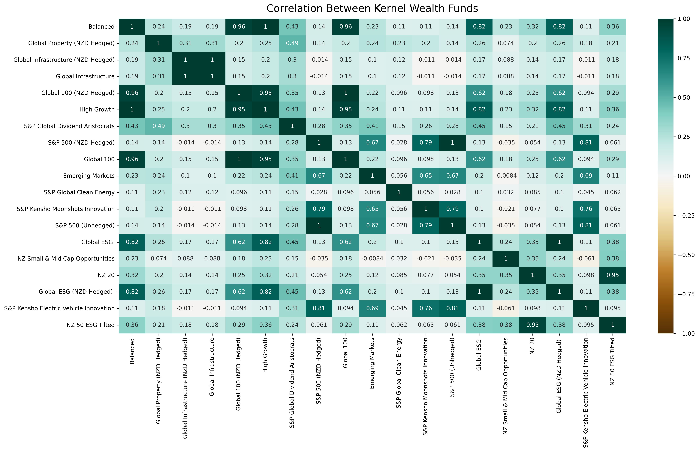
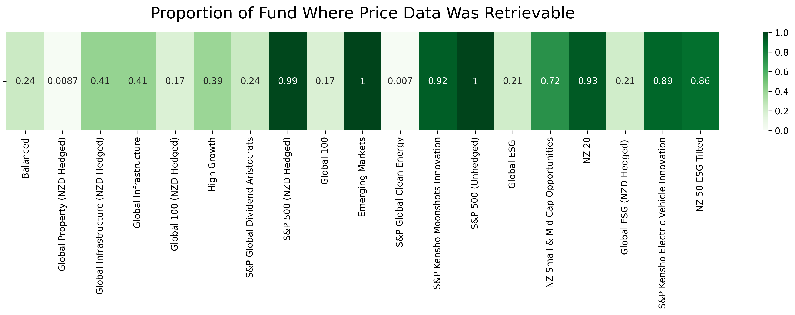

# Kernel Wealth Funds

A repository to retrieve and analyse the makeup of each Kernel Wealth fund. Correlation between funds is calculated using daily returns, and coverage is the total proportion of the funds for which price data was able to be retrieved for calculations.

## Correlation Between Funds

## Coverage of Funds

Due to inability to detect the correct ticker symbol for many assets, price data doesn've have 100% coverage for each funds value. The coverage for each fund is shown below.

